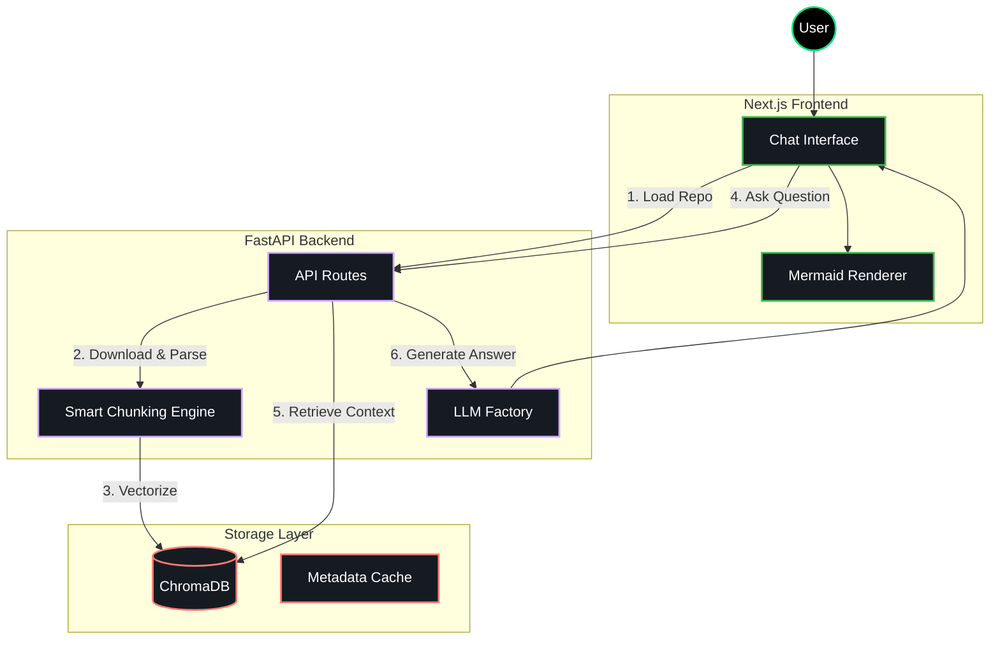

# 🧠 Codebase AI Assistant

Chat with **any GitHub repository** — with real code understanding.

Full-stack RAG application powered by **Smart Chunking**, architecture diagrams, and multi-LLM support (Gemini, OpenAI, DeepSeek, Grok). Unlike standard chat tools, it understands code structure. It uses Smart Chunking to preserve function/class boundaries, generates System Architecture Diagrams automatically, and supports Multi-LLM switching (Gemini, OpenAI, DeepSeek, Grok).

## ✨ Key Features

### 🚀 Advanced RAG Engine

- **Smart Chunking** — preserves functions/classes boundaries  
- **Context-Aware Indexing** — file paths + imports in every chunk  
- **Hybrid Caching** — instant repo switching via local `repo_metadata.json`

### 🎨 Production-Grade UI/UX

- **DeepWiki-style architecture diagrams** (interactive Mermaid.js)  
- **Quote & Reply** — highlight + follow-up questions  
- **File Explorer** — recursive tree of indexed files  
- **Dark / Light mode** with glassmorphism design

⚙️ Technical Capabilities

* Multi-Model Support\
  Instantly switch between:

  * Gemini 2.5 Flash (Free / Fast)

  * GPT-4o

  * DeepSeek

  * Grok

* Private Repository Support\
  Secure access to private GitHub repositories using PAT authentication.

* Windows Optimized\
  Robust handling for file locking, cleanup, and filesystem quirks on Windows.

🛠️ Tech Stack

* Frontend\
  * Next.js (App Router)
  * Tailwind CSS
  * Lucide React
  * Mermaid.js

* Backend\
  * Python FastAPI

* AI / LLM\
  * Google Generative AI (Gemini)
  * OpenAI SDK (compatible with DeepSeek & Grok)

* Vector Database\
  * ChromaDB (local persistence)

* Processing\
  * pypdf (PDF support)
  * ast (code parsing)

## 🏗️ System Architecture

⚠️ *This diagram is automatically generated by the application itself.*



🚀 Getting Started

* Prerequisites
  * Python 3.10+
  * Node.js 18+
  * Git


## 🚀 Quick Start – Installation & Setup


```markdown
## Quick Start (TL;DR)

```bash
git clone https://github.com/yourusername/codebase-ai.git
cd codebase-ai

# Backend
python -m venv venv && source venv/bin/activate    # or venv\Scripts\activate on Windows
pip install -r requirements.txt                    # or pip install fastapi uvicorn ...
cp .env.example .env && nano .env                  # add your API keys
python server.py

# Frontend (new terminal)
cd frontend
npm install
npm run dev
```
📖 Usage Guide

* Load a Repository
  1. Paste a GitHub repository URL (e.g. https://github.com/fastapi/fastapi)\
  2. Click Load
  3. The system downloads, chunks, and indexes the repository

* Performance Notes
  ⏳ First load takes time.
  ⚡ Subsequent loads use cached metadata.

* View Architecture
  The system automatically generates a Mermaid architecture diagram.
  Use zoom and pan controls to explore the blueprint.

* Chat with Context
  Ask questions like:
  “How does authentication work?”
  “Where is the database connection initialized?”
  Responses include file references with line numbers.

* Quote & Reply
  1. Select any text from an AI response
  2. Click “Ask Codebase”
  3. The quoted text appears in the input box for focused follow-ups

* Force Re-Indexing
  If the remote repository changes:
  Click the Refresh (↻) icon in the sidebar
  This forces a fresh download and re-index


🤝 Contributing

Contributions are welcome!
Feel free to submit a Pull Request or open an issue for discussion.

